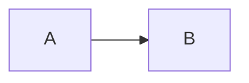
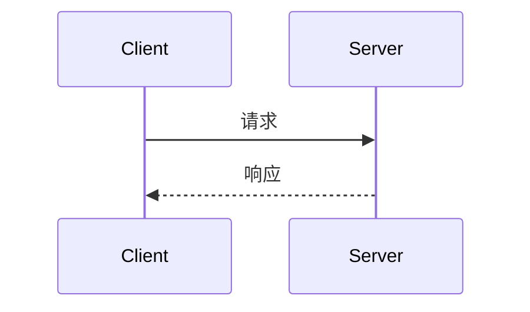

# 文档图示

适用于 Markdown 文档中的流程图、时序图、状态图等.

需要图示时, 统一使用 **Mermaid** 代码块, 按场景选类型:

- 流程、架构、数据流 → `flowchart`
- 时序、调用链、协议交互 → `sequenceDiagram`
- 状态迁移 → `stateDiagram-v2`

流程图示例:

````markdown

````

时序图示例:

````markdown

````

- 不用 ASCII 艺术图代替 Mermaid
- 参与者/节点名避免 `*`, `()`, `→` 等特殊字符; 中文可用 `participant X as 显示名`
- 说明文字 (消息、Note) 用中文; 协议关键字、类型名保留英文
